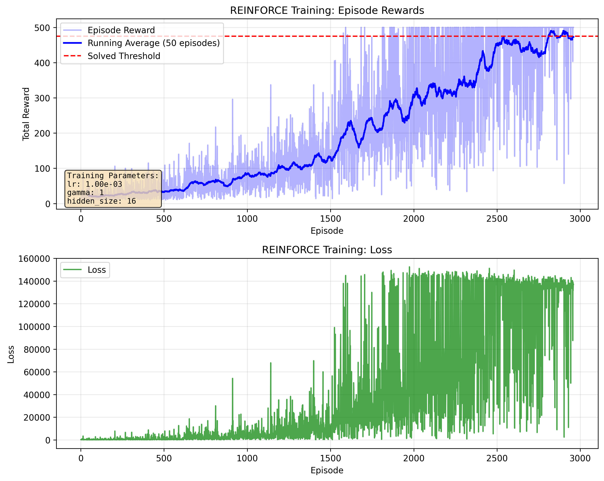

# RL Code Examples

## REINFORCE Applied to CartPole-V1

Smaller nerwork with `hidden_size=16` seems to have much less varaince
than larger models. 
- The training rewards vary quite a lot - it's normal for REINFORCE.
- The training loss is not decreasing - also normal for RL. As your agent survives longer,
  there will be more terms in the loss function.

The loss function is
$$
L(\theta) = - \sum_{t=0}^{T} G_t \log \pi_\theta(a_t | s_t)
$$
where $G_t$ is the discounted return from time $t$.

