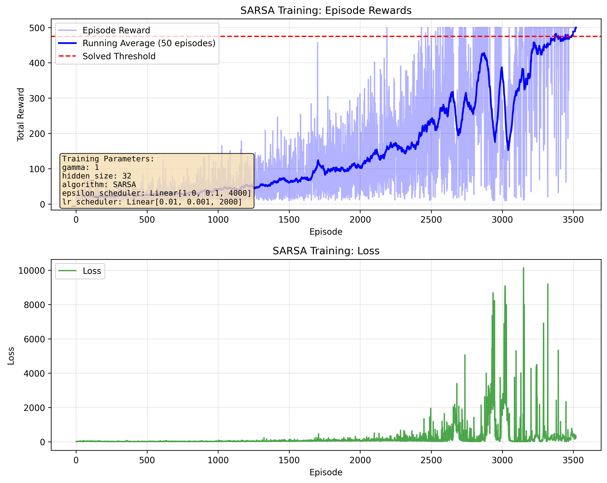
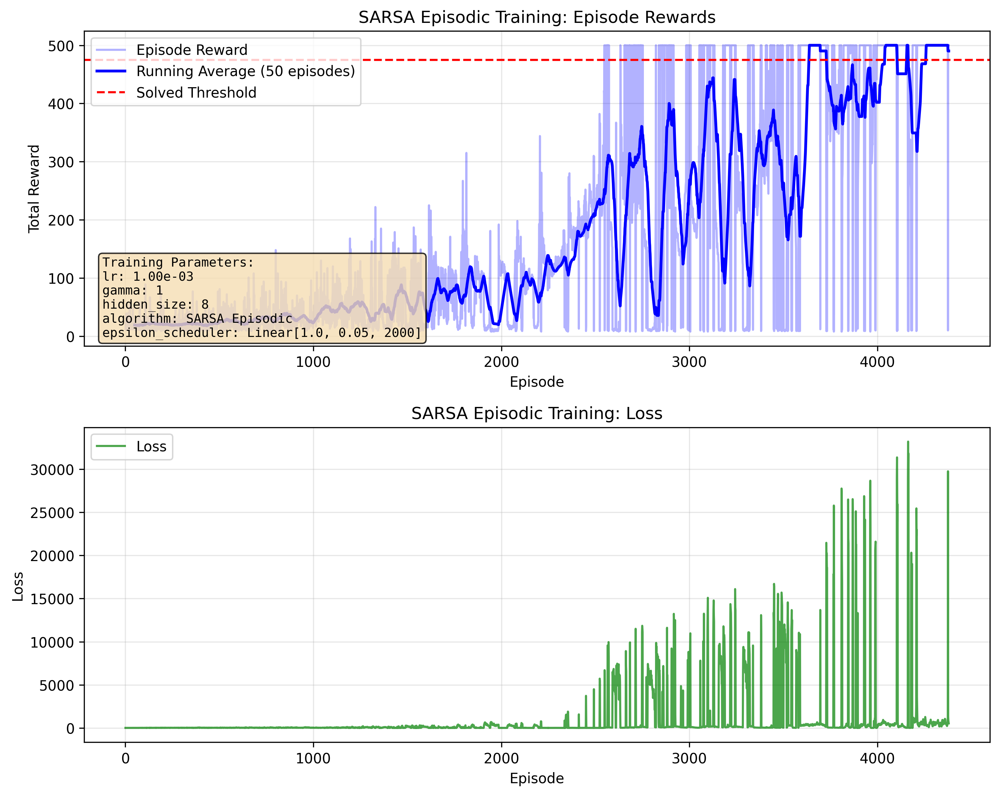

# RL Code Examples

## REINFORCE Applied to CartPole-V1

Smaller nerwork with `hidden_size=16` seems to have much less varaince
than larger models. 
- The training rewards vary quite a lot - it's normal for REINFORCE.
- The training loss is not decreasing - also normal for RL. As your agent survives longer,
  there will be more terms in the loss function.
- `gamma=1` works best and my intuition is smaller gamma does not encourage 
  long term survival.

The loss function is
$$
\mathcal{L}(\theta) = - \sum_{t=0}^{T} G_t \log \pi_\theta(a_t | s_t)
$$
where $G_t$ is the discounted return from time $t$.

## SARSA with Function Approximation

I find it very hard to get the model to converge with with a small neural network.
Often the reward function drops significantly during training.

The SARSA loss function is 
$$
\mathcal{L}(\theta) = \frac{1}{2} \left[ r_t + \gamma Q_\theta(s_{t+1}, a_{t+1}) - Q_\theta(s_t, a_t) \right]^2
$$

SARSA training rewards with learning rate decay and epsilon decay.

SARSA with episodic training. Still very noisy.

